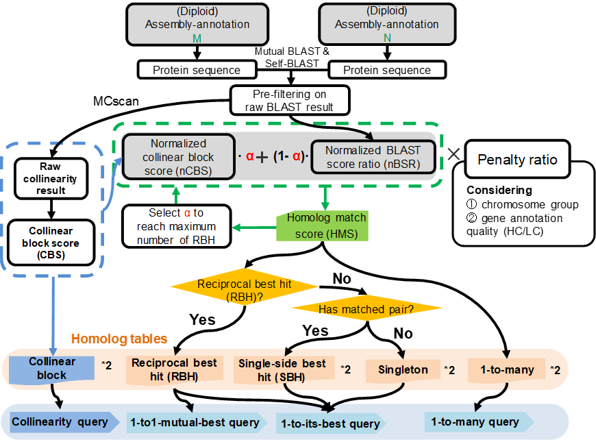

# 1 What is GeneTribe

<center>Figure 1 The core workflow of GeneTribe</center>
**GeneTribe**, a multiple-level homolog-identification pipeline, takes advantages of collinearity block scores and chromosome group information. It is more suitable for identifying types of homologous genes for genetically closed assemblies. 

## Command

```sh
genetribe -h
```

```sh
# Program: genetribe (tools for homologoues inference)
# Version: 0.1.0

# Usage: genetribe <command> [options]

# Subcommands include:

# [ pipeline ]
#      core           The core workflow of genetribe
#      sameassembly   The Homolog inference for same assembly

# [  tools ]
#      RBH            Obtain Reciprocal Best Hits(RBH)
#      CBS            Calculate Collinearity Block Score(CBS)
#      longestcds     Extract the longest protein sequence from protein fasta

# Author: Chen,Yongming; chen_yongming@126.com
```
